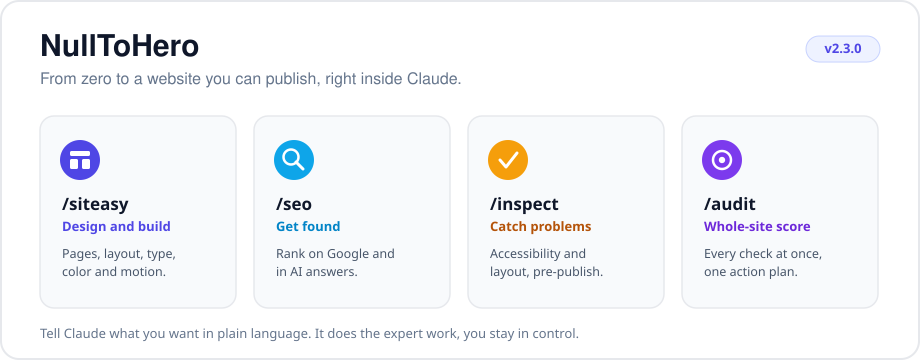
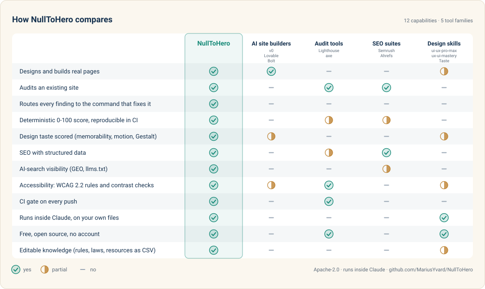

<div align="center">

# NullToHero



**Build a website you are proud of, even if you have never written a line of code.**

[](https://github.com/MariusYvard/NullToHero/releases)
[](LICENSE)
[](https://github.com/MariusYvard/NullToHero/actions/workflows/validate.yml)
[](https://github.com/MariusYvard/NullToHero)

**v2.3.0** · 4 skills · 62 commands · 129 reference docs · 15 audit sub-agents

</div>

NullToHero is an add-on for Claude. Install it once, then ask Claude in plain language to design your pages, get them ranking on Google, and check them for problems before you publish. Claude does the expert work, you stay in control.

<div align="center">
  <picture>
    <source media="(prefers-color-scheme: dark)" srcset="docs/demo-dark.gif">
    
  </picture>
</div>

<div align="center">

[What it is](#what-is-nulltohero) · [Pick your goal](#pick-your-goal) · [Install](#install) · [Skills](#the-four-skills) · [Compare](#how-nulltohero-compares) · [Workflow](#how-a-project-flows) · [Assets](#ready-made-assets)

</div>

---

## What is NullToHero

Claude already writes code. NullToHero gives it the taste and the checklists of a senior web team: a designer, an SEO specialist, a quality inspector, and a reviewer who looks at the whole site at once.

You do not learn commands by heart. You say what you want ("make this landing page look more premium", "why am I not on Google", "is this ready to ship"), and Claude picks the right tool. The sections below show what each tool produces so you know what to expect.

---

## Pick your goal

| I want to | Type this | What you get back |
|-----------|-----------|-------------------|
| Start from nothing | `/siteasy express "a coffee shop site"` | Brief to styled landing page: concept, tokens, build, checks |
| Build a page or component | `/siteasy build` | Real, production-ready front-end that matches your brand file |
| Make it better (bland, busy, static, off) | `/siteasy improve index.html` | The right axis picked from your complaint and applied |
| Check the whole site | `/audit yoursite.com` | One site health score and one merged action plan |
| Fix what the audit found | `/siteasy fix` | Findings executed batch by batch through the remediation map |
| Rework an existing site | `/siteasy overhaul yoursite.com` | Baseline, fixes, before/after proof the score moved |
| Finish and ship | `/siteasy ship` | Polish, defect scan, deterministic audit and hardening, in order |
| Be found on Google and in AI answers | `/seo yoursite.com` | A scored report and a prioritized action plan |
| Get a client-ready report | `/audit report` | Deliverable Markdown, self-contained HTML page, or PDF |
| See it the way a real browser does | `/inspect preview index.html` | Desktop and mobile screenshots, bugs fixed in a loop |

---

## Install

NullToHero is a Claude Code plugin and a marketplace in one repository.

**A. From the marketplace (recommended, auto-updates)**

```
/plugin marketplace add MariusYvard/NullToHero
/plugin install null-to-hero@null-to-hero-marketplace
```

Later, pull new releases with `/plugin marketplace update null-to-hero-marketplace`.

<details>
<summary><b>Manual install (macOS, Linux, Windows)</b></summary>

**B. Manual install (macOS, Linux)**

```bash
git clone https://github.com/MariusYvard/NullToHero.git
bash NullToHero/install.sh
```

**C. Manual install (Windows PowerShell)**

```powershell
git clone https://github.com/MariusYvard/NullToHero.git
powershell -ExecutionPolicy Bypass -File NullToHero/install.ps1
```

> [!WARNING]
> A one-liner (`bash <(curl -fsSL https://raw.githubusercontent.com/MariusYvard/NullToHero/main/install.sh)`) also works, but it runs a remote script directly. Clone and read `install.sh` first if you want to inspect it.

</details>

> [!TIP]
> The short forms `/siteasy`, `/seo`, `/inspect` and `/audit` work as long as no other plugin claims the same name. If you run several plugins, use the namespaced form `/null-to-hero:siteasy`.

---

## The four skills

The doors above are the way in. The four skills below are the full reference behind them: every command stays callable on its own.

<table>
<tr>
<td valign="top" width="50%">

<br>
**Design and build.** Plan, build, make it responsive, add motion.<br>
`/siteasy express` · `/siteasy build` · `/siteasy improve`

</td>
<td valign="top" width="50%">

<br>
**Get found.** Audit, structured data, sitemaps, AI-search visibility.<br>
`/seo audit` · `/seo schema` · `/seo geo`

</td>
</tr>
<tr>
<td valign="top" width="50%">

<br>
**Check before you publish.** Anti-pattern scan, browser preview, code review.<br>
`/inspect detect` · `/inspect preview` · `/inspect review`

</td>
<td valign="top" width="50%">

<br>
**Whole site in one pass.** Every specialist at once, one score, one action plan.<br>
`/audit` · `/audit verify` · `/audit compare`

</td>
</tr>
</table>

###  Design and build

Your design partner. It plans the look, builds the pages, fixes spacing and type, makes everything responsive, and adds tasteful motion. You describe the goal, it produces real, production-ready front-end.

<details>
<summary><b>All 33 commands</b></summary>

| Command | What it does |
|---------|-------------|
| `build [feature]` | Shape, then build a feature end-to-end |
| `shape [feature]` | Shape the UX/UI before writing code |
| `setup` | Create PRODUCT.md and DESIGN.md context |
| `concept [project]` | Set the creative direction before building: idea, anti-reference, signature moment |
| `research [scope]` | UX research planning, methods selection, persona and journey synthesis; generates empathy maps, journey maps and service blueprints |
| `ia [target]` | Information architecture, card sorting, tree testing, navigation patterns |
| `document` | Generate DESIGN.md from existing project code |
| `extract [target]` | Pull reusable tokens and components into a design system; the `handoff` deliverable emits the developer spec (layout, tokens, props, states, breakpoints, motion, accessibility) |
| `tokens [project]` | Audit or create a two-layer CSS token system — primitives + semantic layer + dark mode |
| `critique [target]` | UX design review with heuristic scoring |
| `audit [target]` | Technical quality checks (a11y, perf, responsive, WCAG 2.2, image strategy, forms) |
| `improve [target]` | One door for "make it better": symptom-to-axis dispatch to the right refine or enhance pass |
| `fix [target]` | Execute audit findings by remediation route: triage, per-command batches, verify |
| `polish [target]` | Final quality pass before shipping |
| `amplify [target]` | Amplify safe or bland designs — bolder typography, stronger color, more presence |
| `simplify [target]` | Reduce visual noise, tone down, strip to essence |
| `clarify [target]` | UX copy, error messages, button labels, empty states |
| `harden [target]` | Production hardening + performance — errors, i18n, edge cases, Core Web Vitals |
| `onboard [target]` | First-run flows, empty states, feature discovery, activation |
| `animate [target]` | Add purposeful animations and motion |
| `typeset [target]` | Typography audit, font selection, hierarchy |
| `layout [target]` | Spacing systems, visual rhythm, grid tools |
| `charts [target]` | Accessible data visualization: chart-type choice, a11y grades, non-color fallbacks |
| `adapt [target]` | Mobile/tablet/desktop/print adaptation |
| `mobile [target]` | Phone-specific ergonomics — thumb zone, touch targets, mobile navigation, virtual keyboards, mobile audit |
| `delight [target]` | Micro-interactions, personality in copy, satisfying feedback |
| `overdrive [target]` | View Transitions API, WebGL, scroll-driven animations |
| `video [target]` | Guaranteed-play decorative video: classify, transcode to a canvas-decodable asset (WASM decoder), emit the drop-in component |
| `parallax [target]` | Multi-layer depth, scrollytelling, AI-adaptive motion governance, WCAG 2.2.2 compliance |
| `live [target]` | Interactive variant mode (requires running dev server) |
| `ship [scope]` | Finish-and-ship pipeline: polish, defect scan, deterministic audit, hardening, final audit |
| `overhaul [url]` | Audit-driven rework: baseline, fix by remediation route, before/after compare, ship |
| `express [brief]` | Zero-to-landing: setup, concept, tokens, plan, build, motion, checks, harden |

Common runs: a new page (`setup` → `shape` → `build` → `layout` → `adapt` → `amplify` → `harden`), a refresh (`improve` → `polish`), after an audit (`fix` → `ship`), a design system (`document` → `extract` → `tokens`).

</details>

###  Get found

Your search expert. It audits a whole site or a single page, writes the structured data Google wants, builds sitemaps, and checks how visible you are in AI answers.

<details>
<summary><b>All 20 commands</b></summary>

| Command | What it does |
|---------|-------------|
| `audit [url]` | Full site SEO audit — crawls up to 500 pages, scores 7 dimensions, outputs ACTION-PLAN.md |
| `page [url]` | Deep single-page analysis — title, meta, H1-H6, schema, images, content quality, search-experience alignment (intent, page-type match), score |
| `plan [business-type]` | Complete SEO strategy — architecture, content pillars, keyword plan, 4-phase roadmap |
| `technical [url]` | Technical audit — robots.txt, sitemaps, Core Web Vitals, mobile, security, JS rendering |
| `schema [url]` | Detect, validate, and generate Schema.org JSON-LD — Organization, Article, Product, etc. |
| `content [url]` | E-E-A-T analysis, readability, keyword density, AI citation readiness |
| `geo [url]` | AI search optimization — Google AI Overviews, ChatGPT, Perplexity, llms.txt, brand signals |
| `sitemap [url]` | XML sitemap validation and generation with industry-specific templates |
| `indexnow [url]` | Instant-indexing pings to Bing, Yandex, Naver and Seznam — key setup, single/batch/sitemap submission; the fast lane into the indexes that feed AI answers |
| `images [url]` | Image SEO audit — alt text, formats (WebP/AVIF), lazy loading, CLS, LCP |
| `local [business]` | Local SEO — Google Business Profile, NAP consistency, citations, reviews, LocalBusiness schema |
| `hreflang [url]` | Hreflang validation and generation for multilingual and multi-region sites |
| `programmatic [url]` | Programmatic SEO — URL patterns, quality gates (warn 100+, hard stop 500+), deduplication |
| `competitor-pages [url]` | "X vs Y" and "alternatives to X" pages with feature matrices, FAQ schema, conversion hooks |
| `cluster [keyword]` | Semantic keyword clustering — intent-based grouping, content architecture, gap analysis |
| `drift [url]` | SEO drift monitoring — baseline capture, change detection, history tracking |
| `backlinks [url]` | Backlink profile analysis via free data sources (Moz, Bing, Common Crawl, GSC) |
| `ecommerce [url]` | E-commerce SEO — product pages, category pages, faceted navigation, Product schema |

Common runs: new site (`plan` → build → `technical` → `schema` → `sitemap` → `audit` → `/audit report`), existing site (`audit` → `technical` → `content` → `geo` → `backlinks`), a page that will not rank (`page` → `content` → `schema`), local business (`local` → `schema` → `geo`), before a redesign (`drift baseline` → redesign → `drift compare`).

</details>

###  Check before you publish

Your quality gate. Three quick checks to run before you ship.

<details>
<summary><b>All 3 commands</b></summary>

| Command | What it does |
|---------|-------------|
| `detect [target]` | Deterministic anti-pattern scan — finds missing focus rings, clipped dropdowns, pure black/white, tiny touch targets, missing reduced-motion, and more |
| `preview [target]` | Real Chromium screenshot — desktop + mobile viewports, reads back visually, fixes bugs in a loop |
| `review [file]` | Design engineering code review — motion crimes, a11y violations, forbidden patterns, Before/After table with score; plus code robustness (security, performance, correctness) |

Common runs: before every ship (`detect` → `preview` → `review`).

</details>

###  The whole site in one pass

Runs every specialist at once across search, defects and design, then merges everything into one score and one action plan ordered by priority. The orchestration is documented in [docs/ARCHITECTURE.md](docs/ARCHITECTURE.md).

<details>
<summary><b>All 6 commands</b></summary>

| Command | What it does |
|---------|-------------|
| `full [url] [scope]` | All 15 sub-agents across SEO, defects, and design; unified report + action plan. Optional scope runs one group: `seo` (5 SEO sub-agents), `defects` (4 inspect), `design` (6 siteasy), `quick` (one per group for a fast triage) |
| `checks [url]` | Deterministic pre-pass only: computed checks plus `SITE-AUDIT.json`, no sub-agents |
| `verify [url]` | Consensus re-check: re-runs the gating dimensions (a11y, interaction, technical) K times and reconciles them by majority vote |
| `compare [A] [B]` | Diff two targets (before/after a site, or A vs B): per-check verdict changes and score deltas |
| `learnings [file]` | Review LEARNINGS.md candidates accumulated by real audits and turn accepted ones into rules, gates, laws or fixtures |
| `report [file]` | Format an existing audit into a client-ready report, a self-contained HTML page, or PDF |

The deterministic pre-pass behind `checks` fetches the page once (optionally rendering a client-rendered SPA with Playwright), computes the objectively decidable verdicts (33 checks: contrast, image dimensions, viewport, robots.txt, headings, titles, security headers, video hygiene, motion guards, media weight and more), attaches to each one the `fixWith` route toward the command that fixes it, and writes a machine-readable `SITE-AUDIT.json`. That JSON powers a structural `compare`, score-over-time, and a CI gate you can drop into any repo as a GitHub Action (`uses: MariusYvard/NullToHero@v2.3.0`). See [docs/ARCHITECTURE.md](docs/ARCHITECTURE.md) and [tools/audit/README.md](tools/audit/README.md). To analyze a live site in the browser with Claude, see [docs/CLAUDE-IN-CHROME.md](docs/CLAUDE-IN-CHROME.md).

Common runs: a full pass (`audit`), a consensus re-check (`audit verify`) or a before and after diff (`audit compare`).

</details>

---

<details>
<summary><b>See sample output</b></summary>

A theme from `/siteasy tokens`, a drop-in `:root` stylesheet with WCAG-checked tokens:

```css
:root {
  --bg: #0B0B0C;
  --surface: #161618;
  --fg: #F5F5F4;
  --accent: #6E56CF;     /* on-accent 5.2:1, passes AA */
  --ring: #6E56CF;
  --text-lg: clamp(1.25rem, 1.1rem + 0.6vw, 1.6rem);
}
```

Structured data from `/seo schema`, valid Schema.org JSON-LD ready to paste:

```json
{
  "@context": "https://schema.org",
  "@type": "Organization",
  "name": "Example",
  "url": "https://example.com",
  "logo": "https://example.com/logo.png"
}
```

An action plan from `/audit`, ordered by severity:

```md
## Action plan

### Critical
- Contrast 3.1:1 on the hero CTA. Raise the accent or darken the label.

### High
- LCP 3.8s. Preload the hero image and set fetchpriority="high".

### Medium
- Heading order skips from H2 to H4. Renumber the section.
```

</details>

---

## How NullToHero compares

NullToHero overlaps four kinds of tool. The honest comparison: each column is excellent at what it is for, none of them spans the whole loop of building, auditing, scoring and fixing inside your own files.

<p align="center">
  <picture>
    <source media="(prefers-color-scheme: dark)" srcset="docs/compare-dark.svg">
    
  </picture>
</p>

<details>
<summary><b>Text version of the table</b></summary>

| Capability | **NullToHero** | AI site builders<br><sub>v0 · Lovable · Bolt</sub> | Audit tools<br><sub>Lighthouse · axe</sub> | SEO suites<br><sub>Semrush · Ahrefs</sub> | Design skills<br><sub>ui-ux-pro-max · ux-ui-mastery · Taste</sub> |
|:---|:---:|:---:|:---:|:---:|:---:|
| Designs and builds real pages | ✅ | ✅ | — | — | 🟡 |
| Audits an existing site | ✅ | — | ✅ | ✅ | — |
| Routes every finding to the command that fixes it | ✅ | — | — | — | — |
| Deterministic 0-100 score, reproducible in CI | ✅ | — | 🟡 | 🟡 | — |
| Design taste scored (memorability, motion, Gestalt) | ✅ | 🟡 | — | — | 🟡 |
| SEO with structured data | ✅ | — | 🟡 | ✅ | — |
| AI-search visibility (GEO, llms.txt) | ✅ | — | — | 🟡 | — |
| Accessibility: WCAG 2.2 rules and contrast checks | ✅ | 🟡 | ✅ | — | 🟡 |
| CI gate on every push | ✅ | — | ✅ | — | — |
| Runs inside Claude, on your own files | ✅ | — | — | — | ✅ |
| Free, open source, no account | ✅ | — | ✅ | — | ✅ |
| Editable knowledge (rules, laws, resources as CSV) | ✅ | — | — | — | 🟡 |

<sub>✅ yes · 🟡 partial · — no. Nuances: Lighthouse's deterministic score covers performance, not design or content; Semrush's Site Health score is deterministic but proprietary and not CI-native; builders generate tasteful UI without judging or scoring it.</sub>

</details>

NullToHero is the one that spans build, defects, SEO and a scored whole-site audit in a single plugin, with every finding routed to the command that fixes it. It is not a hosted product or a visual editor: it runs inside Claude and edits the real files in your project, so the output is yours to keep and version.

---

## How a project flows

The doors are the flow. A project usually walks through five of them:

```
/siteasy express        nothing yet: brief to a first shippable page
        or
/siteasy build          something exists: add the next piece
     |
/siteasy improve        "make it better": the right axis, one pass at a time
     |
/audit                  the whole site, scored, every finding routed to its fix
     |
/siteasy fix            execute the findings, batch by batch
     |
/siteasy ship           polish, scans, hardening, gates: out the door
```

Reworking an existing site instead: `/siteasy overhaul` chains the baseline audit, the fixes and the before/after proof. Growing traffic after launch: `/seo plan` sets the strategy and names the specialist passes to run; `/seo drift` watches for regressions.

<details>
<summary><b>The same flow, specialist by specialist</b></summary>

```
/siteasy research       understand the users
/siteasy ia             validate the structure
/siteasy setup          define brand, audience, tone
/siteasy shape          shape the UX before coding
/seo plan               build the SEO strategy in parallel
/seo cluster            group keywords by intent
     |
/siteasy build          build the interface
/siteasy tokens         set up the token system
/siteasy layout         fix spacing and rhythm
/siteasy adapt          make it responsive
/siteasy mobile         tune phone ergonomics
     |
/siteasy amplify        make it beautiful
/siteasy simplify       strip to the essence
/siteasy typeset        refine the typography
/siteasy animate        add motion
/siteasy delight        add micro-interactions
/siteasy clarify        sharpen the copy
     |
/inspect detect         catch anti-patterns
/inspect preview        see it in a real browser
/siteasy critique       heuristic UX review
/inspect review         final code-quality gate
/siteasy polish         last quality pass
     |
/seo audit              full SEO check
/seo technical          crawl and render health
/seo schema             add structured data
/seo content            E-E-A-T and readability
/seo images             image SEO
/seo geo                AI-search visibility
     |
/siteasy harden         harden for production
/audit report           client-ready report
/seo drift              watch for regressions
```

</details>

> [!TIP]
> In a hurry, `/audit yoursite.com` runs the whole check in a single pass.

---

<details>
<summary><b>Set up your project</b></summary>

NullToHero works best with two small files in your project root. Claude reads them so its output matches your brand.

- `PRODUCT.md`, who your users are, your brand, tone and anti-references. Create it with `/siteasy setup`.
- `DESIGN.md`, your colors, typography and components. Generate it with `/siteasy document`.

Two more appear as you work: `DIRECTION.md` (the committed creative direction, written by `/siteasy concept`) and `LOG.md` (the running journal the journeys append to and resume from).

</details>

---

## Ready-made assets

The `assets/` folder ships an original, license-clean starter library: 139 icons, 20 background patterns, 18 spot illustrations, 34 animations and 6 templates. Icons and patterns take the surrounding color and the animations honor `prefers-reduced-motion`. Everything is CC0 for the media and MIT for the templates, so it is safe to copy into any project. Open `assets/gallery.html` to browse the whole set, and `assets/README.md` for how to wire each kind in. During a build, `/siteasy build` recommends curated external sites first and uses this library as a fallback for quick, offline or placeholder assets.

## What is inside

NullToHero ships **129 reference docs** that Claude loads only when it needs them, so a large project does not eat your context budget.

<details>
<summary>See the full knowledge base</summary>

**siteasy, design (80):** accessibility-engineering, adapt, animate, animation-engineering, assets-library, audit, bolder, brand, brand-identity, clarify, cognitive-load, color-and-contrast, color-systems, colorize, component-patterns, component-recipes, concept, craft, creative-patterns, critique, css-architecture, dark-mode-engineering, data-viz, delight, design-tokens, distill, document, elevation, extract, fetch-asset, fix, form-patterns, gestalt, handoff, harden, heuristics-scoring, image-strategy, improve, information-architecture, inspiration, interaction-design, journey-express, journey-mapping, journey-overhaul, journey-ship, landing-patterns, layout, live, memorability, mobile-ergonomics, motion-choreography, motion-design, onboard, optimize, overdrive, parallax, personas, polish, print-styles, product, quieter, resource-recipes, resource-recommendations, responsive-design, shape, ship-checklist, signature-moments, sourcing-external-code, spatial-design, stock-media, style-systems, teach, testing-strategy, tokens, typeset, typography, ux-research, ux-writing, video, wcag-2-2

**seo, search (23):** action-plan, audit, backlinks, cluster, competitor-pages, content, drift, ecommerce, geo, head-meta, hreflang, images, indexnow, local, page, performance, plan, privacy-consent, programmatic, schema, sitemap, sxo, technical

**seo, plan assets (6):** agency, ecommerce, generic, local-service, publisher, saas

**inspect, defects (4):** code-quality, detect, preview, review

**audit, whole-site (6):** checks, compare, full, html-report, learnings, report

**shared state and routing:** `DIRECTION.md` and `LOG.md` project files read by every command, `tools/data/laws.csv` (16 canonical numeric laws, CI-checked citations), `tools/data/remediation-map.csv` routing every check and rule to the command that fixes it (`fixWith` in SITE-AUDIT.json), and `tools/reference-graph.json` (the reference graph, zero orphans enforced by CI).

A stack-aware design-system generator also lives under `tools/design-system/`, covering 16 technology stacks (React, Next.js, Vue, Svelte, Astro, Nuxt, Angular, Laravel, HTML and Tailwind, shadcn/ui, SwiftUI, React Native, Flutter, Jetpack Compose, Three.js, Nuxt UI).

</details>

---

<details>
<summary><b>Requirements</b></summary>

- **Node.js**, for `/inspect preview`, `/inspect detect` and the validator (`tests/validate.js`).
- **Playwright**, installed on first `/inspect preview` run.
- **Python 3**, for the design-system generator (`/siteasy setup`) and the Python tests.

</details>

---

## Project

- Changes by version: [CHANGELOG.md](CHANGELOG.md)
- How to contribute: [CONTRIBUTING.md](CONTRIBUTING.md)
- Reporting a vulnerability: [SECURITY.md](SECURITY.md)
- Credits and third-party licenses: [ATTRIBUTION.md](ATTRIBUTION.md), [NOTICE](NOTICE)

```bash
node tests/validate.js   # run before opening a PR
```

---

<div align="center">

Built by [Marius Yvard](https://mariusweb.fr/cv) · [Releases](https://github.com/MariusYvard/NullToHero/releases) · [Changelog](CHANGELOG.md) · [Contributing](CONTRIBUTING.md)

License: Apache 2.0. See [LICENSE](LICENSE).

</div>
