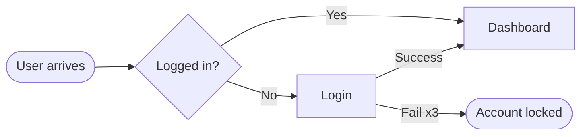

# Journey Mapping

Methods for visualizing how users move through a product or service over time, what they think and feel at each step, and which moments break the experience. Use this reference when stakeholders disagree on where the problems are, when a redesign touches more than one team, or when the gap between intention and reality needs to be made undeniable. Pair with [ux-research.md](ux-research.md), [personas.md](personas.md), and [shape.md](shape.md).

The output of mapping is not a poster, it is alignment. A journey map that hangs on a wall but does not drive decisions is decoration.

## Method Selection

| Method | Scope | Time horizon | When to use |
|---|---|---|---|
| Empathy map | One persona, one mental state | Snapshot | Early discovery, persona definition |
| User flow | One task, one user | Minutes | Designing a specific interaction |
| Customer journey map | One persona across multiple touchpoints | Days to months | Mapping end-to-end experience |
| Experience map | One topic across multiple personas and channels | Months to years | Strategic overview |
| Service blueprint | One service including backstage processes | Real-time | Coordinating cross-functional teams |

Pick one. Combining methods in a single artifact produces something nobody reads.

## Empathy Map

Captures what a persona says, thinks, feels, and does at a specific moment. Built quickly, used during ideation.

Layout: a 4-quadrant grid centered on the persona's name.

| Quadrant | Captures |
|---|---|
| Says | Verbatim quotes from research |
| Thinks | Inferred attitudes and beliefs |
| Does | Observed actions and workarounds |
| Feels | Emotional state, dominant emotions |

Optional bottom strips:
- Pains: friction, fears, frustrations
- Gains: rewards, wants, success criteria

Time to produce: 30 to 60 minutes per persona. Use immediately after interviews while the material is fresh.

## User Flow

A diagram of the logical steps to complete one task. Decision points are diamonds, screens are rectangles, errors are red.

When to use:
- Designing a new flow before wireframes
- Auditing an existing flow for redundancy
- Aligning engineering on the happy path plus edge cases

What to include:
- Entry points (every way a user arrives at the flow)
- Screens or states
- Decisions the user makes
- Decisions the system makes
- Success exits
- Failure exits

Tools: FigJam, Whimsical, Miro, draw.io, Mermaid for code-friendly diagrams.

A user flow with more than 15 nodes is too granular for a map. Split it.

## Customer Journey Map

The canonical mapping artifact. One persona, one scenario, multiple stages, with emotional trajectory.

Standard columns (left to right): journey stages from awareness through to retention or churn.

Standard rows (top to bottom):
1. Stage name and user goal at that stage
2. Actions the user takes
3. Touchpoints (website, app, email, support, store)
4. Thoughts and verbatim quotes
5. Emotions, plotted as a curve from negative to positive
6. Pain points and friction
7. Opportunities

The emotion curve is the most powerful single element. It makes the bad moments undeniable.

### Building it

1. Pick one persona. Maps that try to serve all personas at once collapse.
2. Pick one scenario. "Onboarding to first value" is one map. "Renewing a subscription" is another.
3. Use real research material, never imagine. Verbatim quotes anchor the artifact.
4. Identify stages. Typical stages: awareness, consideration, purchase, onboarding, use, support, advocacy.
5. Plot the emotion curve from research notes. Tag the steepest negative drop as the primary opportunity.
6. Annotate opportunities tied to specific moments. Vague "improve onboarding" is useless. Concrete "send a follow-up email at day 3 when 60 percent of users go dormant" is actionable.

### Distribution

A journey map is a communication tool. Distribute it as a single-page PDF, paste it into the product brief, post it in the team channel. If only the designer has seen it, it failed.

## Experience Map

Broader than a journey map. Covers a topic, not a single persona's path. Used for strategy.

Example: a hospital's "patient experience" across multiple personas (patient, family member, referring doctor) and channels (admission, waiting room, treatment, billing, follow-up).

Structure: same rows as a journey map, but with persona swimlanes or topic swimlanes instead of stages.

Best produced after multiple journey maps for individual personas exist. The experience map is the synthesis.

## Service Blueprint

Adds operational dimensions to the customer journey: backstage processes, support systems, and the moments where they fail the front stage.

Layers (top to bottom):
1. Customer actions
2. Frontstage actions (what the customer sees: staff, interface)
3. Backstage actions (what the customer does not see: ops, fulfillment)
4. Support processes (systems, third parties, infrastructure)
5. Evidence (artifacts the customer encounters)

Crossings are revealing. When a customer action triggers a frontstage action that requires a backstage action that depends on an external system, every dependency is a failure point.

Use service blueprints to:
- Identify single points of failure
- Audit handoffs between teams
- Estimate the operational cost of a "small" UX change
- Align product, ops, and support on a single source of truth

## Anti-Patterns

- Mapping without research. The map reflects the team's assumptions, not the user's reality.
- Mapping a persona that does not exist. Aspirational personas produce aspirational maps.
- Combining multiple personas in one map. The map becomes a generic average that fits no one.
- Maps that live in Figma and nowhere else. Distribution is the point.
- Maps without explicit opportunities. The map describes the problem, the opportunities drive action.
- Maps that never get updated. The user's journey changes; the map should too.

## Quality Bar

A useful map can answer these in under 30 seconds:
1. Who is this about (which persona)?
2. What are they trying to do (which scenario)?
3. Where does it fail (which stage)?
4. How do they feel about it (emotion curve)?
5. What should the team change (opportunities)?

If any of these takes longer than 30 seconds to find, the map is too dense. Simplify.

## Cross-References

- Research methods feeding the maps: [ux-research.md](ux-research.md)
- Persona archetypes anchoring the maps: [personas.md](personas.md)
- IA implications of journey discovery: [information-architecture.md](information-architecture.md)
- Cognitive cost across the journey: [cognitive-load.md](cognitive-load.md)
